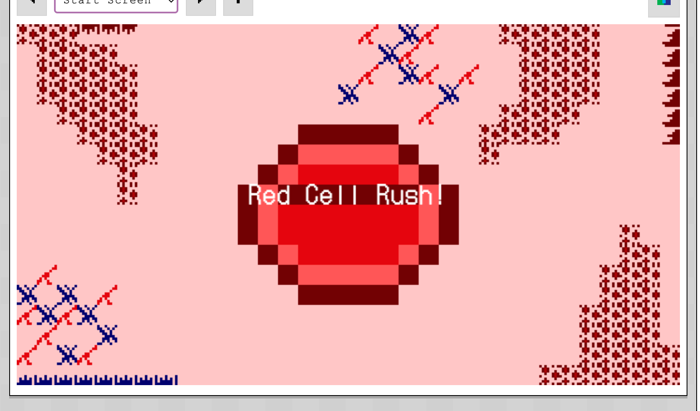
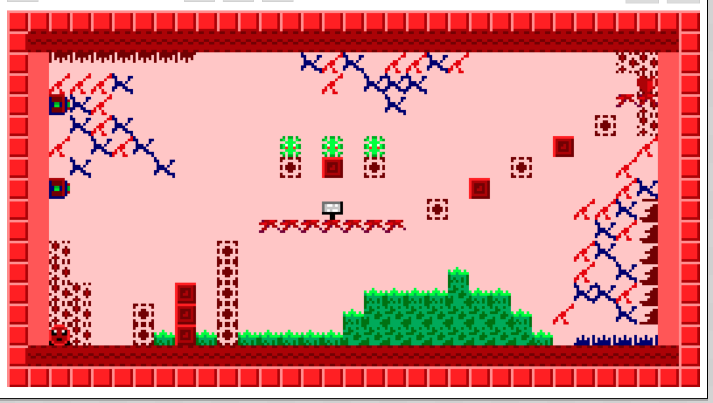
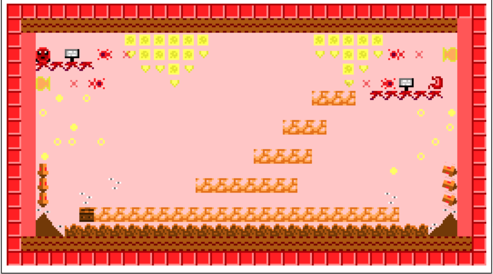
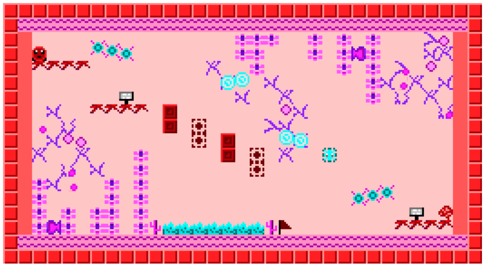
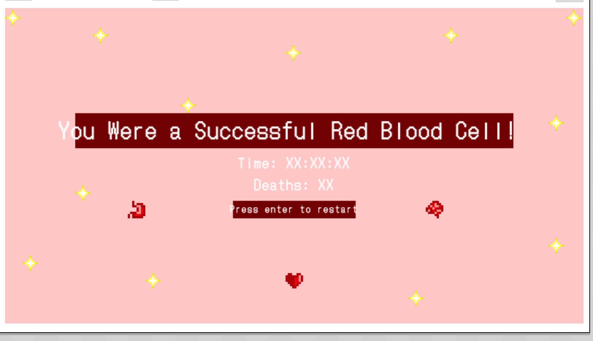
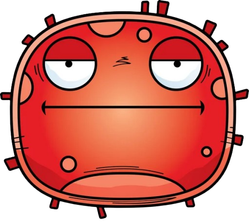
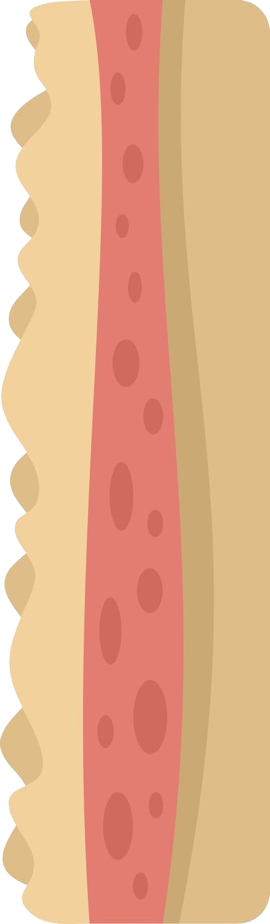
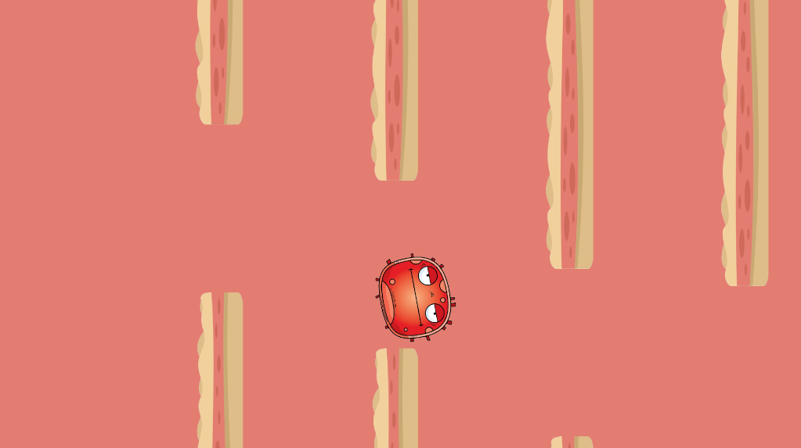
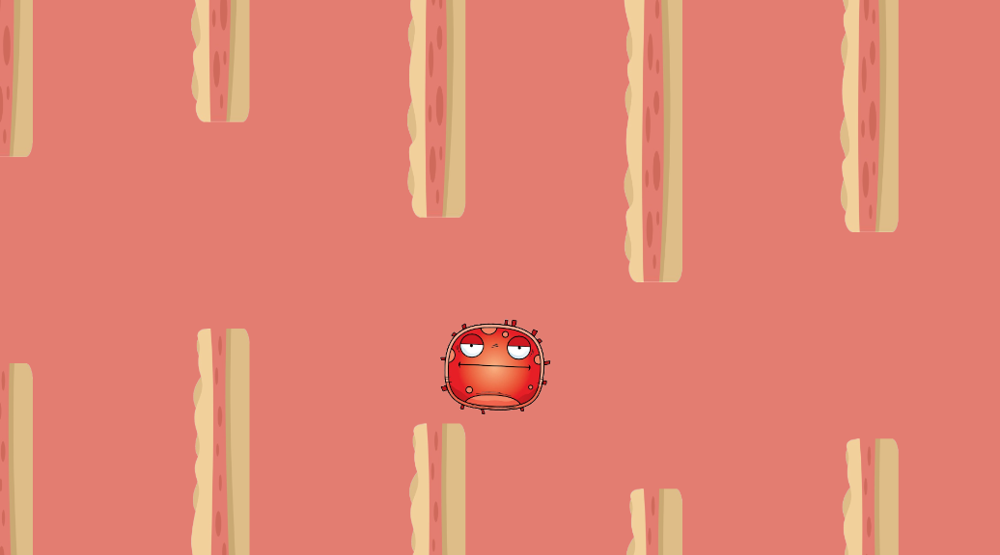
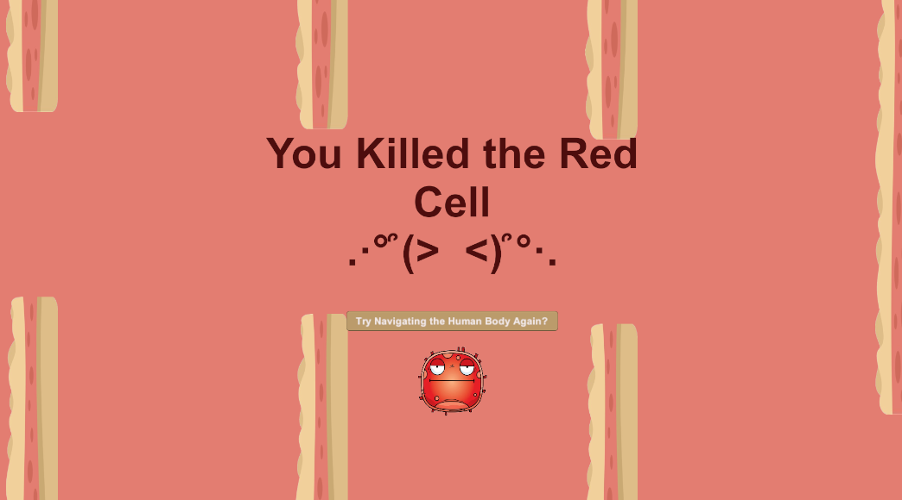

# ( ╹ -╹)?💭Process Journal( ╹ -╹)?💭

## ────୨ৎ────Tiny Game | January 23rd 2025────୨ৎ────

"Red Cell Rush" is a quirky pixelated platformer where players control a red blood cell navigating through organs to deliver blood. The concept evolved after much trial and error—from food-themed ideas inspired by Japanese street food and desserts like my original idea of a sushi-themed game, where a fish avoids becoming food, being scrapped due to its complexity. And then turning into an entirely new human-body themed concept and game. Honestly this idea came from an epiphany I got while watching Netflix and procrastinating the weekend before the deadline which helped me finalize the concept.
The game includes three organ-themed levels: Heart, Stomach, and Brain. These choices were partly influenced by what was easiest to draw with Pocket Platformer’s limited tools and perhaps a little hunger while working on this assignment (hence the stomach). Each level is creatively designed to reflect the organ’s environment, such as the stomach level having acid and "poop" obstacles.

Developing the game wasn’t without its struggles. Designing a human-body world in a pixelated style, creating obstacles, and getting familiar with Pocket Platformer under time pressure were overwhelming at times and had me stressing since we weren’t really introduced to anything the week prior due to the power outage.
Despite the challenges, the game achieved a cohesive and fun thematic style. I focused heavily on visual aesthetics, because I really like working on atmospheric elements when it comes to designing stuff. However, over-prioritizing theme over gameplay left some areas for improvement, such as deeper level design, better player challenges, and excluding musical elements. Also, I could’ve created a much longer game.

To be honest "Red Cell Rush" kept a humoristic aspect in my opinion of being a cell dodging poop obstacles or viruses in the human body, I tried to mainly focus on an original idea and theme/environment for this assignment more than level design which is what I’m hoping to learn or get better at throughout this course. Hence why my game design for this is super-duper basic. I also may have stayed in vacation mode too long and procrastinated too much for this which is why I probably found it chaotic and the poor overall delivery.

During the playtest everyone loved the game and the thematic experience of it being the human body. However, signs were in the way of the experience or need to be more carefully placed. Players actually did find the game difficult although I thought it was overly simple which was a pleasant surprise.

## ────୨ৎ────First Time Unity: Bootleg Flappy Bird | January 30th 2025────୨ৎ────

Bootleg Fally bird was mainly inspired by the demo presented in class last week. I was mainly inspired to this when the teacher made a falling circle onto a box. It kind of dawned on me as I was zoning out from tiredness of lack of sleep due to staying up late the night prior doing Red Cell Rush. 

Neverthless, this small prototype was to test or get my hands dirty with Unity. Being a first timer this was a pretty big challenge trying to figure out how Unity works and all the different components were quite overwhelming I must say. I felt a Flappy Bird type game would be the perfect concept to understand collision, movement, camera and placement when it comes to Unity. Basically everything shown in the class. Again, remembering that this was mainly a test assignment, so not taking it too seriously and not "try-hard" too much doing this. I used it more as a discovery moment. 

The way I wanted to personalize this project a bit more and not make it a complete Flappy Bird copy was to draw inspiration by "Red Cell Rush" my previous assignment being themed around the human body and its functions. So, following that idea I just grabbed a funny image of a red blood cell from the internet and skin clipart images as the walls the user isn't supposed to touch. For some reason this semester a lot of my projects have revolved around the human body's components which is funny, so why not continue the theme? I didn't create my own images maybe because I was lazy but mostly because I didn't want to spend too much time on things outside of Unity for this mini test. Again, really just wanted to get to know the program more than focusing on making a visually and absolutely new game/creation. 

I would say Unity is interesting in how everything really has to be added and then modified through coding which might be a challenge for me in the future of this class since I'm not the best coder. Regardless I'm going to thug it out and hopefully learn to understand it more. I like how whatever I do in code it's immediately presented/compiled in Unity and how certain components are modular/modifiable within the app itself instead of having to go to VS Code and code it myself. 

Honestly, I would've loved to spend more time making the entire thing more of a game instead of an interactive "unfinished" looking creation. I must admit I have been swamped this week and may have waited too long to start this mini experimental assignment but at least I got something and learned something. I believe this also happened because peers told me how this is a highly experimental and unserious assignment which is why it is the way it is.

For the future of this course and my Unity path, I would want to explore more point systems, counters, state changes and work more on collision elements for future assignments when I will allocate myself more time. 

Main thing: Didn't want to create something crazy new because I wanted to spend most of my time getting familiar with Unity and it was also my first time coding in C# so might as well code a game that's somewhat easy to code. 

