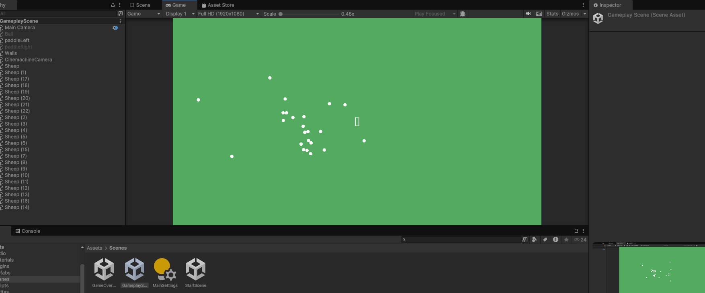

# ( ╹ -╹)?💭Process Journal( ╹ -╹)?💭

## A1────୨ৎ────Tiny Game | January 23rd 2025────୨ৎ────

"Red Cell Rush" is a quirky pixelated platformer where players control a red blood cell navigating through organs to deliver blood. The concept evolved after much trial and error—from food-themed ideas inspired by Japanese street food and desserts like my original idea of a sushi-themed game, where a fish avoids becoming food, being scrapped due to its complexity. And then turning into an entirely new human-body themed concept and game. Honestly this idea came from an epiphany I got while watching Netflix and procrastinating the weekend before the deadline which helped me finalize the concept.
The game includes three organ-themed levels: Heart, Stomach, and Brain. These choices were partly influenced by what was easiest to draw with Pocket Platformer’s limited tools and perhaps a little hunger while working on this assignment (hence the stomach). Each level is creatively designed to reflect the organ’s environment, such as the stomach level having acid and "poop" obstacles.

Developing the game wasn’t without its struggles. Designing a human-body world in a pixelated style, creating obstacles, and getting familiar with Pocket Platformer under time pressure were overwhelming at times and had me stressing since we weren’t really introduced to anything the week prior due to the power outage.
Despite the challenges, the game achieved a cohesive and fun thematic style. I focused heavily on visual aesthetics, because I really like working on atmospheric elements when it comes to designing stuff. However, over-prioritizing theme over gameplay left some areas for improvement, such as deeper level design, better player challenges, and excluding musical elements. Also, I could’ve created a much longer game.

To be honest "Red Cell Rush" kept a humoristic aspect in my opinion of being a cell dodging poop obstacles or viruses in the human body, I tried to mainly focus on an original idea and theme/environment for this assignment more than level design which is what I’m hoping to learn or get better at throughout this course. Hence why my game design for this is super-duper basic. I also may have stayed in vacation mode too long and procrastinated too much for this which is why I probably found it chaotic and the poor overall delivery.

During the playtest everyone loved the game and the thematic experience of it being the human body. However, signs were in the way of the experience or need to be more carefully placed. Players actually did find the game difficult although I thought it was overly simple which was a pleasant surprise.

## A2────୨ৎ────Bootleg Flappy Bird | January 30th 2025────୨ৎ────

Bootleg Fally bird was mainly inspired by the demo presented in class last week. I was mainly inspired to this when the teacher made a falling circle onto a box. It kind of dawned on me as I was zoning out from tiredness of lack of sleep due to staying up late the night prior doing Red Cell Rush. 

Neverthless, this small prototype was to test or get my hands dirty with Unity. Being a first timer this was a pretty big challenge trying to figure out how Unity works and all the different components were quite overwhelming I must say. I felt a Flappy Bird type game would be the perfect concept to understand collision, movement, camera and placement when it comes to Unity. Basically everything shown in the class. Again, remembering that this was mainly a test assignment, so not taking it too seriously and not "try-hard" too much doing this. I used it more as a discovery moment. 

The way I wanted to personalize this project a bit more and not make it a complete Flappy Bird copy was to draw inspiration by "Red Cell Rush" my previous assignment being themed around the human body and its functions. So, following that idea I just grabbed a funny image of a red blood cell from the internet and skin clipart images as the walls the user isn't supposed to touch. For some reason this semester a lot of my projects have revolved around the human body's components which is funny, so why not continue the theme? I didn't create my own images maybe because I was lazy but mostly because I didn't want to spend too much time on things outside of Unity for this mini test. Again, really just wanted to get to know the program more than focusing on making a visually and absolutely new game/creation. 

I would say Unity is interesting in how everything really has to be added and then modified through coding which might be a challenge for me in the future of this class since I'm not the best coder. Regardless I'm going to thug it out and hopefully learn to understand it more. I like how whatever I do in code it's immediately presented/compiled in Unity and how certain components are modular/modifiable within the app itself instead of having to go to VS Code and code it myself. 

Honestly, I would've loved to spend more time making the entire thing more of a game instead of an interactive "unfinished" looking creation. I must admit I have been swamped this week and may have waited too long to start this mini experimental assignment but at least I got something and learned something. I believe this also happened because peers told me how this is a highly experimental and unserious assignment which is why it is the way it is.

For the future of this course and my Unity path, I would want to explore more point systems, counters, state changes and work more on collision elements for future assignments when I will allocate myself more time. 

Main thing: Didn't want to create something crazy new because I wanted to spend most of my time getting familiar with Unity and it was also my first time coding in C# so might as well code a game that's somewhat easy to code. 

## A3────୨ৎ────Lonely Pong | February 5th 2025────୨ৎ────

Yikes. This week was very hard in terms of finding inspiration or motivation to do much. Seasonal depression? Overwhelming life circumstances? Lack of sleep? Not sure... BUT! Nonetheless life goes on and here's what I came up with for this "mini" assignment. It might be a bit minimalistic but this can be explained with the challenging week I had and also in how Unity is still VERY new to me and I'm still mainly exploring the platform. 

While being shown the demo Pong game last week in class, I realized how it was a two player game. Knowing this, I thought "what if you don't have someone to play with?" You can't really play it otherwise if you're missing a player. Now with this issue I figured why not create a single player version of it? I know this already exists obviously but I'm still using these small assignments as a way of discovering Unity so, again like Bootleg Flappy I want to keep it simple. Hence, the creation of Lonely Pong. 

How did I make it "lonely" or in better words a single player game. I thought about the mobile game "Color Switch" in how it's super simple, single player and also involves a ball with platforms. So why not try to incorporate that circular movement within Pong? I went with the idea keep the cell(ball) within the boundaries of the vein(circular background). 

For the creation of this lonely game, I wanted to personalize it a bit and seeing how this semester I have an amazing human body/function/anatomy/cell theme going on I'm still going to pursue it. Also, having a theme helps me feel more inspired when creating these little games/simulations. Saying that, I decided to keep the same character I had for Bootleg Flappy because it's a circular shape and works perfectly for pong. For the platform I just grabbed an image from Google which is a spine clipart that fit perfectly for my game. Since this is purely and exploratory assignment I didn't want to waste too much time creating my own images and wanted to focus more on what Unity does. 

In terms of what I learned in this project would be dealing with pivot points to create that circular dynamic/path that the spine platform follows. I also learned how to import my own Scripts since the ones Unity were offering were to be frank, boring and didn't follow my "cellular" theme. I had fun dealing with bounds and collisions for either ball which in my case is the red cell and the spine platform. I would say dealing with speed, velocity, randomness, gravity and movement were more of a challenge in this assignment. It's definetely hard to get the right "feel" for player movement and for the ball. Learning how to balance difficulty and what the player can actually do to "win" is a new aspect in game design that I learned throughout this process which was a nice discovery. 

For the future, I would like to incorporate more screens/scenes but I'm still new to Unity so it's still a complex system for me to grasp and fully understand so maybe for the next assignment I'll try to dive deeper in scene managemet. I only know how to do an end one for now. I would also like to figure out how to increase the velocity of the ball overtime to make the game harder overtime and less boring.

Forgot to add and thought about it mid class, the spine image turning into a sprite for unity to read was a headache! I couldn't figure out how to make it read as a whole image and not just little parts. Had to figure out how the sprite editor worked and was a massive headache for me. Almost dropped the whole image itself because of how complicated it was since its not a square, circle, rectangle heart or a simple shape!!!

Main thing: This week was a tough one mentally, again didn't want to do anything too crazy within Unity because for one I don't know how, it's still very new to me and used this again as an exploratory thing. For two, I just wasn't in the right headspace to try many new things this time. 

## A4────୨ৎ────Bone Breaker | February 12th 2025────୨ৎ────

Geez. Last week's lecture was so hard to follow I got lost so many times it was really exhausting, my code didn't even properly run or wasn't even the same thing the teacher was getting so it was a huge question mark week. With that in mind I had to really stick to basic stuff for this mini assignment just so that I could actually grasp what we actually did in class. I went the more artistic route with this prototype since I spent most of my time figuring out what the heck was covered. But to give it my own twist I just modified a lot of the visual elements as best as I could. 

So, going into this prototype I went in with the mindset of there's already so many versions of block breaker and it's such a well known game that it's super-or almost impossible to create a new unique spinnoff of it. With that I told myself why not just focus on a visual variation of the game since it's simple and I can still learn throughout the process the main mechanics of the whole game/concept. Now, knowing this I again followed my body/anatomy theme going on for this semester just because it's easier to come up with an idea when following a theme for me, I need some type of constraint or else my imagination runs wild. So, I wanted to deviate from the cell concept since the human body has a lot more to it and also for the sake of creativity and less repetition throughout my assignments. One of the first ideas that came to mind was something to do with bones since they do break in certain individual's lifetimes. Hence,  the name bone breaker because in theory the user uses a skull to follow the skeletal theme to break bones on the top of screen acting as the bricks. 

To make the game flow more intersting, I made it so that the bones have multiple "breaking" levels. In other words, meaning the player has to hit some of them multiple times in order to make the bones go away, or fully destroy them in simpler terms. I tried to also make the bounce factor different depending on where the skull touches the platform. For example, if the right side is hit it bounces at a different velocity and angle compared to if the player hits the center of the platform. 

Honestly, don't have much to say for this assignment unlike my other ones since I was really confused from last week's lecture and spent a really long time reviewing the content. I learned a lot about velocity, angles, scene switching and more about how sprites work. 

I would like to say I struggled mostly with scene management and figuring out how building and connecting scenes worked in Unity. It was such a painful process. Also, an equally painful process that I'm still not used to even after the last assignment "Lonely Pong" is importing my own sprites. It is such a tedious process! To make sure the colliders and rigid body to be perfectly on the imported sprite is COMPLICATED. Also, making sure to see how Unity reads the image itself and how it imports it depending on complex the image is. 

Final conclusion while creating Bone Breaker, I can't seem to finish this mini assignment as a full game. This mini prototype is just breaking my brain and I'm completely uninspired doing it. I have to leave it unfinished because my brain hurts and will try harder for the next one, the inspiration is slighlty lower on this one. I will say I created a framework where I could build off of this idea for a bigger game in the future but for now this is what I came up with. In the future levels can easily be added and more constraints and difficulties as well. I'm honestly so over this assignment which can be shown with how it's the first one I leave mostly unfinished. At least it's a work in progress and not totally blank. Dealing with scene management and bricks/bones was so hard and boring for me I couldn't bring myself to proceed.

Main thing: Importing complicated sprites is crazy in Unity, velocity and angles are hard to understand. I hate coding. Had fun putting a more visual twist/feel to the project. I think the concept of Bone Breaker is kind of funny. I also like the milk carton platform because...you drink milk for better bones but the user is using it to break them! And it was really late I don't know my brain was fried. 

This is the first state of the bones

This is the second state of the bones

This is the final state of the bones and they disappear after this

## A5────୨ৎ────Poop Jumper Bootleg | February 20th 2025────୨ৎ────

Exhauted is how I'm feeling this week, the snow and cold are definetely not helping motivation or overall productivity school-wise. I also worked a lot more this week than usual. Anyhow, this is what I tried to breifly explore throughout this snow storm. 

Since there wasn't much guidance for this week's prototype I took it as time work on my struggles instead of creating something new.

So, for the past few assignments I've been struggling a lot dealing with velocity, speed and bounce or understanding how it works in Unity. Especially the coding part, I'm not the best coder in the world either which explains why I'm stuggling with these concepts. Hence, to get a better understanding of it I tried to mimick a game that plays literally with all those issues which is the mobile app Doodle Jump. I tried to replicate this concept of jumping on a bouncy platform in my own way by twisting it with my own sprites and slighlty modifying the main mechanics of the original game. Again, following the human body/organs/anatomy that I have going on in this class. To achieve that I decided to make it based on the stomach's functions. Meaning, making it a poop naviguating  intestines. Why? Honestly because it's funny and I haven't made anything super comedic in this class and might as well explore it. 

Not much was actually created or really deeply explored I used this to genuienly get a better understanding of how certain physics work within Unity since I noticed I struggled with certain things multiple times. Used this week as a learning oppurtunity to improve or catch up to the rest of the class in terms of the physics of Unity. 

This process really helped me figure out how to make something bouncy and modify the way in which it falls or reacts to certain objects within the world I'm using. Moreover, it helped me understand how velocity changes and works. I was just able to get more comfortable with it and coding the physics.

One thing important thing is that I learned how to incorporte a timer in my game to represent how long the poop/player is digesting just to add a small challenging component. I wanted to stray away from a counter since we had already seen it and want to learn the most of what I can do with Unity so why not try something new?

Last important takeaway from this mini assignment would be how I learned something new with the components when creating my Intestinal platforms. I discovered the edge collider and the platform effector. These two compoenents make it so that only one side of an object is interactable but the player can still go through it depending on where they "hit" it from. In Poop Jumper it allows the player to pass under the platforms and jump on top of them which is pretty neat!

I honestly don't have much to say for this journal entry because it was less a creative prototype but more a testing/understanding one. I really struggled with the past Block Breaking assignment which is why I wanted to properly learn about the issues I had previously. 

Main thing: Bounce, velocity and speed were better understood this week. Very short entry this time and more learning was done through Poop Jumper. "Rattrapage" -> "Catching Up" session. 

## Prototype 1────୨ৎ────First Process | March 6th 2025────୨ৎ────

Tough times lately, midterms are harsh and my health even harsher. Before going into study break I got the stomach flu for the second time this year and was completely incapacitated from it, I couldn't do anything and attending class was impossible. That being said with the little energy I had I was able to discuss with Sam (classmate teamed up with) the direction we want to go in for our final project and brainstorm quick ideas via discord. 

Concept: 
Sheep hoarding game where the player is a sheperd collecting various types of sheep in the world. Exploration type of game concept. 
Directions: 
Make it so that if the player is missing some sheep consequences happen and make game objectivees to entice the player to get the various types of sheep in the world. The amount of sheep the player has is tied to the healthbar they have. The game will have various types of sheep for example, a black sheep that could have a bomb type of characteristc attached to it. The sheep categories still need to be developed further. 
Atmosphere: 
Explorative, peaceful and naturistic. Sam mentionned he has a friend willing to create audio to enhance the immersion to the game. 
Game POV: 
Pixel art;
3D game using 2D pixel art;
Topside view; (League of Legends, MOBA)
Old Pokemon style.

Reference/Inspiration Pictures During Brainstorming: 

Title of The Game: 

Player Character Design Concept: 

POV Inspiration for the Game:

Desired Art Style:

## Prototype 2────୨ৎ────To Do List with Sam | March 13th 2025────୨ৎ────

Had a Discord call with Sam to decide our game plan for the creation of our Final Project and the components we want to add in it. We mainly spoke about how we want to proceed and what we want to accomplish in the game. The call this week was to help understand what needs to be done in the following weeks to actually accomplish what we have in mind and also be realistic about what we want to do since our ideas beforehand were kind of all over the place. 

The main thing to remember is how we brought down our ideas together to make a clearer game concept and idea since we didn't have a set path or idea. Mainly broke down the huge idea we had in smaller steps to tackle it in an easier manner and to be able to visualize where we're headed with this Shepherd collecting game!

So, to do all of this we did a shared GoogleDocs and wrote down all the things that need to be done and ideas we had and kept for the final product. Also created a breif timeline to follow to accomplish everything by the due date. 

Here's the file we worked on together:

## Prototype 3────୨ৎ────Progress!!! | March 19th 2025────୨ৎ────

A lot of progress was done in less than a week on our Shepherd game between both Sam and I. Although we had a few hiccups trying to figure how to use GitHub to collaborate on this project we pulled through and managed to do something presentable. 

This week the main thing we did this week: 

- Screen/Scene management;
- Build scenes;
- Clickable button on the start screen to switch to the gameplay scene;
- Scene decoration and feel;
- Player movement;
- Sheep movement and herding behaviour for the sheep;
- Camera movement and making it follow the player throughout the simulation;
- A lot of artwork to get the feel of the game.

I would say Sam really did a lot for the player movement and making the sheep move in a herd in some amazing way with placehodlers being little squares. Coding the movement was definetely a challenge. 

Main things: Using GitHub is not an easy feat for either Sam or I, but were learning to use it and managed to figure out how after a long time. Progress was made in super short time and the game is finally coming along. 

Image of what the Start Screen looked like leaving last class (Before)

Image of what the Start Screen looks like now (After)

Image of what the Game Play screen is looking like with placeholders for the sheep and player

Link to see the movement
https://drive.google.com/file/d/11AunPnHIca51EWG2EQu3A7AOhWO88d1-/view

## Prototype 3────୨ৎ────Slow but New Things!!! | March 27th 2025────୨ৎ────

Hard week personally a lot going out in my personal circle which is why this journal entry might be a bit shorter compared to my previous ones but here's what's new!
This week was some slow progress but amazing new discoveries and new elements added to the prototype. Learned a lot about Unity this time and still learning how it works. 

What was added this week, both Sam and I wanted to experiment on interactive dialogue and NPCs/elements that the player can encounter as the game progressed. So, I mainly focused on that throughout this week on my end for the prototype. Basically, I made a very raw version of what the interaction would look like and how it would be triggered by the player by clicking "E". I just used a bunch of placeholder elements because the main objective is to get it functionning and understand the logic behind it. Making things visually stimulating/interesting will come later into play if there's still time. But for the prototype it for sure is just raw and bleak. BUT! It works. Briefly, the main things I learned while doing this was: 
- A lot of text components;
- Arrays;
- The order of events really matter to get everything flowing properly;
- How to trigger events by clicking a key;
- Dialogue Pannels;
- Dialogue elements and how to sequence them by adding elements for the dialogue;

- Button systems.

Main things: Figuring how to order events was figured out in this prototype which will be useful for storytelling and flow of the game for the player. Functionality of the game is still the main objective at the moment. Next thing to overcome is the end event of the game and how you can lose in the game. While doing so, enemies will also be a subject to be tackled for the next week. 

What our Prototype is looking like at the moment:

## Prototype 4────୨ৎ────SO STRESSED BUT TRYING OUT HERE!!! | April 3rd 2025────୨ৎ────

Extremely swampped this week! But Sam and I are trying our best to produce some type of prototype to present next week of our strong concept. Don't have much to say for this week since we didn't work that much on the project this week. 

Few new additions on my end: 

- Created a new scene for the bad ending;
- New assets were added
- Created a start again button for when game ends;
- Trying to create new art for the game;
- Focused on story telling and flow of the game;
- End state was talked about. 

Main things: Focused on story progression and how the game would like if it ended badly. Really focusing on progression for the player these next weeks before we present even though the artwork might not be fully there for the final. Player progression is the priority now and was a bit this past week.

